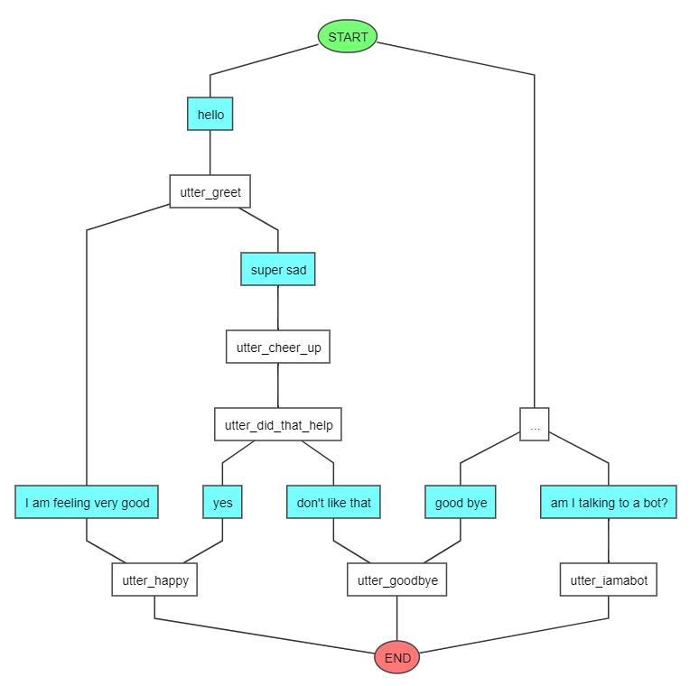

# Study In Rasa

Repository for the study of the RASA package and for the development of a ChatBot

## About the Project
- Python Version: 3.9.x
- Rasa Version: 3.5.5
- Environment: MiniConda

## How to Run

1. Install the requirements with the command: `pip3 install rasa`
2. Run the command: `rasa shell`
3. Talk with the bot

## Flows

